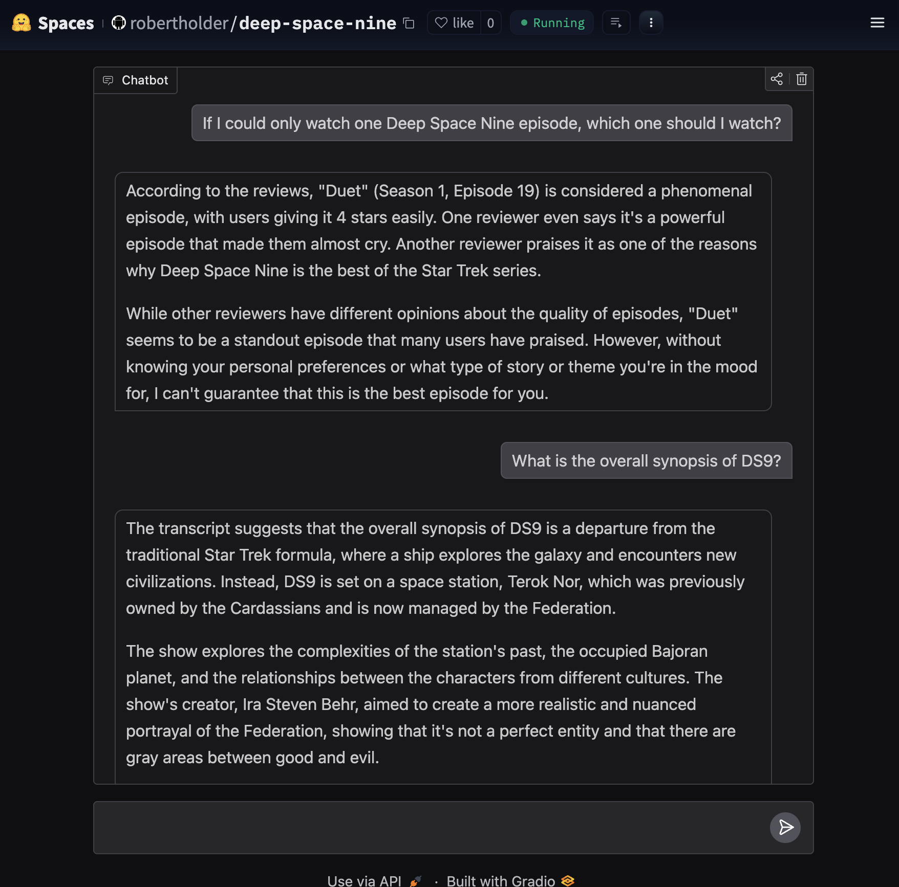

# Deep Space Nine chatbot

Initial pass at creating a Retrieval-Augmented Generation (RAG)-based chatbot based on the commentary of each Deep Space Nine episode at [Jammer's Reviews](https://www.jammersreviews.com/st-ds9/)

Try it out at [https://huggingface.co/spaces/robertholder/deep-space-nine](https://huggingface.co/spaces/robertholder/deep-space-nine)

Example of use:

# Overview

- [parse_summaries.ipynb](https://github.com/RobertHolderIII/LLM/blob/main/deep-space-nine/parse_summaries.ipynb) - loads the summaries from the links from the DS9 homepage of Jammer's reviews. Extracts the text and saves a pickled DataFrame.

- [ds9-chat.ipynb](https://github.com/RobertHolderIII/LLM/blob/main/deep-space-nine/ds9-chat.ipynb) - loads the pickled text, splits it into chunks, and generates embeddings. Populates the Pinecone vector store with embeddings.  Runs some test queries.

# Setup and installation

To run locally,

- get free [Pinecone](https://www.pinecone.io/) API key
- create a Pinecone vector store named `ds9-documents` with embedding dimension `384`.
- get free [Groq](https://console.groq.com/home) API key
- store Pinecone API key as `PINECONE_API_KEY` in the [.env](../.env-example) file
- store Groq API key as `GROQ_API_KEY` in the [.env](../.env-example) file
- (optional, but recommended) create a new python environment and activate
- install required modules by running `pip install -r requirements.txt`
- start Jupyter server
- run parse_summaries notebook
- run ds9-chat notebook
- navigate to deploy directory
- run app.py and note the local link
- point browser to link 

# TODO

- Currently parser loading both the Jammer's review and the reader comments.  I've noticed that does affect the responses.  It would be interesting to see the responses if the responses were based only on one or the other.
- Would like to look into hosting the vector store locally.

